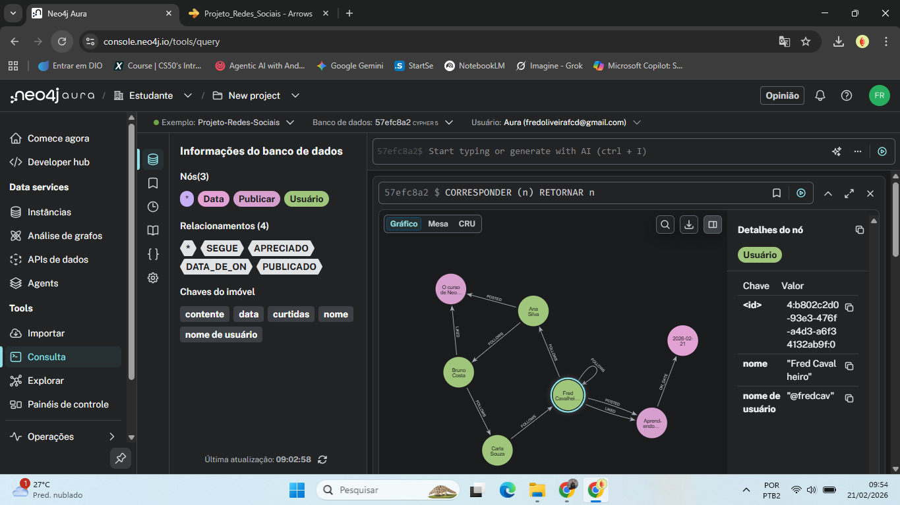

# Projeto Redes Sociais com Grafos

Este projeto foi desenvolvido como parte do desafio prático de modelagem e implementação de bancos de dados de grafos. O trabalho simula a estrutura de uma rede social para analisar conexões, recomendações e performance.

## 🎓 Idealização e Apoio
Este projeto foi realizado por **Fred Cavalheiro** através da plataforma de ensino **[DIO (Digital Innovation One)](https://www.dio.me/)**, com o apoio e infraestrutura providenciados pela **[Neo4j](https://neo4j.com/)**.

---

## 🛠️ Ecossistema e Ferramentas Utilizadas
O projeto foi construído utilizando as seguintes tecnologias:

* **[Arrows.app](https://arrows.app/)**: Utilizado para a modelagem do diagrama de grafos (Modelo Conceitual).
* **[Neo4j AuraDB](https://neo4j.com/cloud/platform/aura-graph-database/)**: Instância de banco de dados de grafos gerenciada na nuvem.
* **[Google Colab](https://colab.research.google.com/)**: Ambiente de desenvolvimento Python para automação e análise de dados.
* **[Kaggle](https://www.kaggle.com/)**: O ambiente foi configurado com integração via **API** para consumo de datasets, embora o foco final tenha sido a carga personalizada de dados via Cypher.
* **[Python](https://www.python.org/)**: Linguagem principal para integração e scripts.

### 📚 Bibliotecas Python Utilizadas
* `neo4j`: Driver oficial para conexão com o banco de dados.
* `pyvis`: Biblioteca para geração de visualizações interativas de grafos.
* `IPython`: Para exibição de resultados dinâmicos no ambiente de desenvolvimento.
* `kaggle`: Utilizada para a configuração e autenticação do ambiente de dados.

---

## 📊 Modelo Conceitual
Abaixo, o diagrama que define as entidades (**User**, **Post**, **Genre**, **Date**) e seus relacionamentos (**FOLLOWS**, **POSTED**, **LIKED**).

---

## 🚀 Implementação e Análises Realizadas
O projeto executa análises complexas através da linguagem **Cypher**, focando em:

1.  **Recomendação de Amizade:** Lógica para sugerir amigos baseada em conexões de segundo grau (amigos de amigos).
2.  **Caminho Mais Curto:** Algoritmo para identificar a menor rota de interação entre dois usuários.
3.  **Ranking de Engajamento:** Identificação dos posts com maior número de interações.
4.  **Relatório de Performance:** Uso da cláusula `PROFILE` para validar a eficiência das consultas, alcançando tempos de resposta de aproximadamente 20ms.

### Visualização do Grafo em Produção (AuraDB)

### Prova de Autoria e Detalhe de Nó

---

## 📞 Contato
**Fred Cavalheiro**
* Projeto desenvolvido para o Portfólio de Dados em Grafos.
